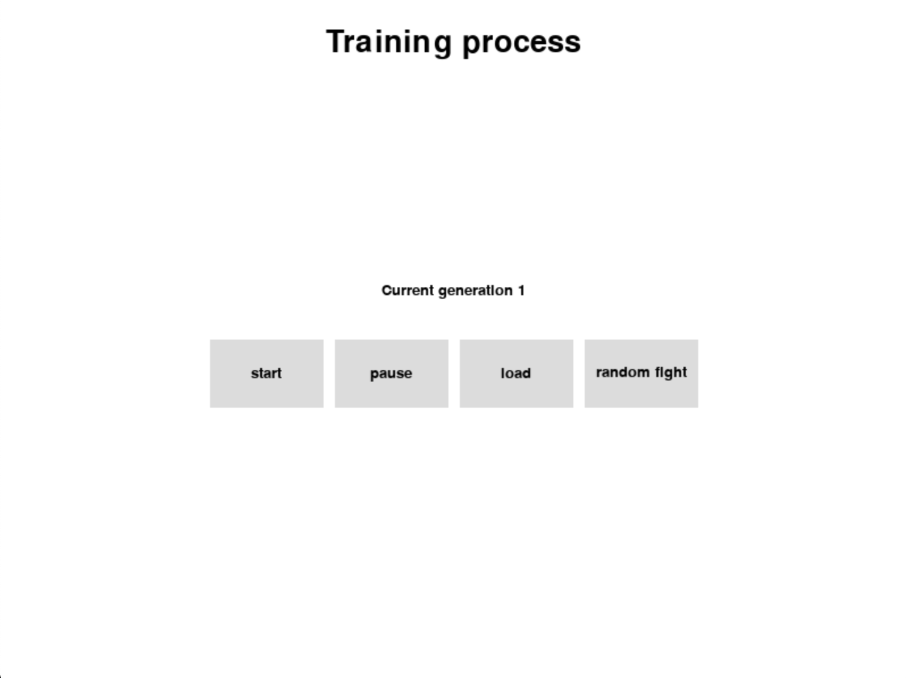

# AI Arena

The idea of this repo is to represent and utilize the power of neural networks trained by a genetic algorithm.

## Technologies and techniques used

1. Pygame for the graphical representation of the game;
2. Neural network for the representation of the fighting creature;
3. Genetic algorithm for the neural network training;

## UI screens

1. The entry screen is the one used for the training:


2. The arena field:


## Functionality

1. The entry screen consists of the following buttons:
   -    **start button** - starts the training. The current generation will be displayed. Info logs can be seen inside the terminal;
   -    **pause button** - the training is being paused, which won't take effect immediately. Once the current generation is evaluated the training process will be terminated;
   -    **load button** - it loads a serialized generation which you can additionally train;
   -    **random fight button** - it takes the best creature so far and spawns an arena against a random one from the same generation;
  
2. The arena screen consists of the following:
    -   actual arena where creatures fight for a certain amount of time;
    -   time left which can be adjusted inside the app_config.json file;
    -   neural network used for the creature;
    -   go back button - it returns back to the main screen;

## Installation
1. Install dependencies in the root directory
```bash
python3 -m venv venv
source venv/bin/activate
pip install -r requirements.txt
```

2. Run the application
```bash
python -m genetics
```

## Configuration
Inside the config folder you can find **app_config.json** file where you can adjust some of the algorithm parameters:


1. **population_size** - the size of the population which will be used for the genetic algorithm training, the more creatures at the beginning - the better results you can expect(what about time?);
2. **selection_type** - currently two selection types available - *roulette*(a creature is chosen for reproduction according to the probabilty generated from its fitness value) and *pair_best_ones*(the best K creatures are chosen for reproduction). More selection types can be added inside genetics -> model -> selection.py file;
3. **mutation_type** - some part of the new generation is mutated in order to generate new genes inside the chromosomes. Two types of mutation available - *all_weights_mutation* and *single_weight_per_node*. Information about them can be found inside genetics -> model -> mutation.py. You can also add new ones;
4. **mutation_rate** - specifies what percent of the new generation should be mutated with a number in the range [0, 1]. Be aware that with *all_weights_mutation* the percent should be much smaller since it mutates every weight of the neural network according to it;
5. **cross_over_type** - specifies the algorithm used for new children generation. Currently two available - *arithmetic* and *two_points*. Additional can be added inside genetics -> model -> cross_over.py;
6. **previous_generation_rate** - specifies the percent of parents (in the range [0, 1]) which should be taken directly to the next generation;
7. **activation_func** - specifies the activation function type. Four currently available - *sigmoid*, *relu*, *leaky_relu*, *tanh*
8. **training_process_number** - the number of processes used for the training. Be aware that 1 process with 1 thread is used for the UI to be interactive and 1 more thread which waits for all training processes to finish. So if you specify 4 training process 5 overall will be used(If you use more than your system can run at the same time - performance drops accordingly);
9. **serialization_frequency** - specifies how often the generation should be serialized(checkpoint);
10. **generation_serialization_folder** - specifies where the generation should be serialized. The file name is *generation.data*;
11. **best_creature_serialization_folder** - specifies where the best creature of the generation to be serialized. The file name is *creature.net*
12. **generation_deserialization_folder** - specifies the folder from which to deserialized. The file looked for is *generation.data*
13. **best_creature_deserialization_folder** - specifies the folder from where to deserialize the best creature. The file looked for is *creature.net*. CURRENTLY NOT USED;
14. **creature_name_tag** - this tag is going to be applied to each creature you generate for future tournaments against other people;
15. **fight_duration_in_s** - specifies how long the fight is going to be;


## TO DO:
1. Implement the tournament functionlity which deserializes a lot of creatures from the same directory and runs a tournament;
2. A lot of hard coded data in the graphics part - should be removed.